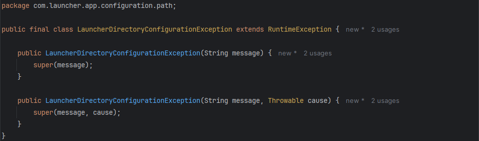

# Throwable Highlighter

[](https://github.com/Hedgerock/throwable-highlighter/actions/workflows/build.yml)

Throwable Highlighter is an IntelliJ IDEA plugin that highlights Java classes
inheriting from `Throwable`.

## Preview



## Features

- Highlights `Throwable` and its subclasses.
- Supports custom exception classes.
- Supports transitive inheritance.
- Highlights both declarations and references.
- Works in fields, local variables, `new`, `throws`, `catch`, and `extends`.
- Provides configurable highlighting through the IDE color scheme.
- Uses the standard Java class highlighting as a fallback.

## Configuration

The highlighting style can be configured under:

`Settings | Editor | Color Scheme | Throwable Highlighter`

## Requirements

- IntelliJ IDEA
- Java support enabled

## Installation

### JetBrains Marketplace

Coming soon.

### Manual installation

1. Download the plugin ZIP from the latest GitHub release.
2. Open `Settings | Plugins`.
3. Click the gear icon and select `Install Plugin from Disk...`.
4. Select the downloaded ZIP.
5. Restart IntelliJ IDEA.

## Development

The project requires JDK 21.

### Run tests

```shell
./gradlew test
```

### Run in the IntelliJ Platform sandbox

```shell
./gradlew runIde
```

### Verify plugin

```shell
./gradlew verifyPlugin
```

### Build plugin

```shell
./gradlew buildPlugin
```

The plugin distribution will be created under:

```text
build/distributions/
```

## License

Licensed under the Apache License 2.0. See [LICENSE](LICENSE) for details.
