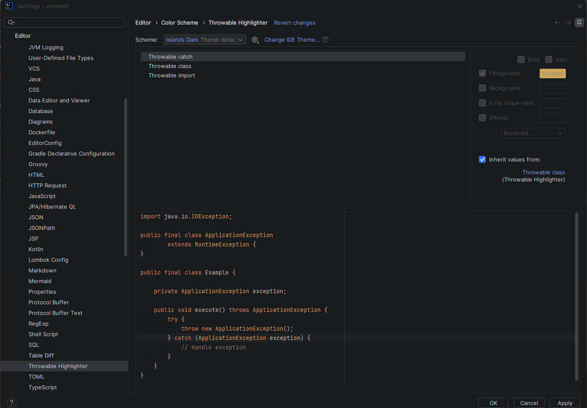

# Настройка подсветки

## Расположение настроек

Настройки плагина находятся в разделе:

```text
Settings | Editor | Color Scheme | Throwable Highlighter
```

Раздел содержит три цветовых ключа:

- `Throwable class`;
- `Throwable import`;
- `Throwable catch`.

### `Throwable class`

Ключ `Throwable class` соответствует `THROWABLE_CLASS`.

`THROWABLE_CLASS` применяется к объявлениям и ссылкам на `Throwable` и его наследников.

По умолчанию ключ наследует стандартный цвет Java-класса из активной цветовой схемы IDE.


### `Throwable import`

Ключ `Throwable import` соответствует `THROWABLE_IMPORT`.

Он применяется к имени класса в явном импорте.

```java
import java.io.IOException;
               ^^^^^^^^^^^
```

Имя пакета в импорте не подсвечивается.

Импорты с символом `*` не подсвечиваются.

### `Throwable catch`

Ключ `Throwable catch` соответствует `THROWABLE_CATCH`.

Он применяется к `Throwable` и его наследникам в параметре `catch`.

```java
catch (IOException exception) {
        ^^^^^^^^^^^
}
```



---

## Наследование цвета

По умолчанию `Throwable import` и `Throwable catch` наследуют цвет от `Throwable class`.

Изменение цвета `Throwable class` применяется к импортам и типам в `catch`, если ни для `Throwable import`, ни для
`Throwable catch` не задано отдельное значение.

Отдельная настройка `Throwable import` влияет только на явные импорты `Throwable` и его наследников.

Отдельная настройка `Throwable catch` влияет только на типы `Throwable` и его наследников в параметрах `catch`.

Чтобы вернуть наследование, необходимо сбросить явно заданные атрибуты для `Throwable import` или `Throwable catch`
в настройках цветовой схемы.


---

## Ограничения

Настройки применяются только к Java-коду.

Подсветка доступна для типов, которые могут быть разрешены IntelliJ IDEA и являются `Throwable` либо его наследниками.
