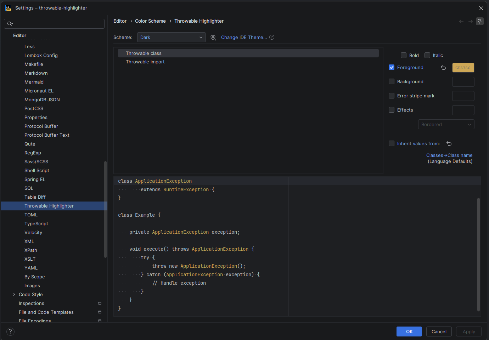
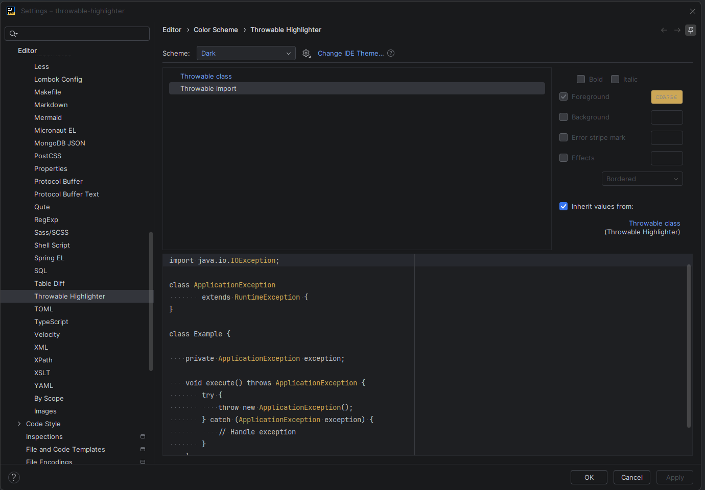

# Настройка подсветки

## Расположение настроек

Настройки плагина находятся в разделе:

```text
Settings | Editor | Color Scheme | Throwable Highlighter
```

Раздел содержит два цветовых ключа:

- `Throwable class`;
- `Throwable import`.

### `Throwable class`

Ключ `Throwable class` соответствует `THROWABLE_CLASS`.

Он применяется к:

- объявлениям классов, наследующих `Throwable`;
- ссылкам на такие классы в Java-коде.

По умолчанию ключ наследует стандартный цвет Java-класса из активной цветовой схемы IDE.



### `Throwable import`

Ключ `Throwable import` соответствует `THROWABLE_IMPORT`.

Он применяется к имени класса в явном импорте.

```java
import java.io.IOException;
               ^^^^^^^^^^^
```

Имя пакета в импорте не подсвечивается.

Импорты с символом `*` не подсвечиваются.

---

## Наследование цвета

По умолчанию `Throwable import` наследует цвет от `Throwable class`.

Изменение цвета `Throwable class` применяется к импортам, если для `Throwable import` не задано отдельное значение.

Отдельная настройка `Throwable import` влияет только на явные импорты классов, наследующих `Throwable`.

Чтобы вернуть наследование, необходимо сбросить явно заданные атрибуты для `Throwable import` в настройках цветовой схемы.



---

## Ограничения

Настройки применяются только к Java-коду.

Подсветка доступна для классов, которые могут быть разрешены IntelliJ IDEA и являются наследниками `Throwable`.
